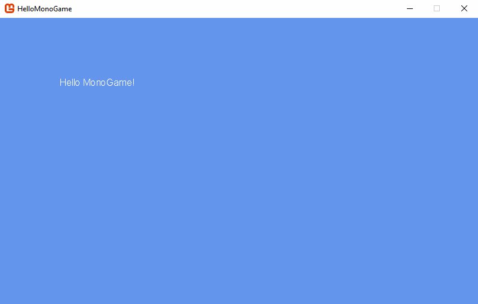

# Hello MonoGame

Hello World with MonoGame.

I created this project because MonoGame doesn't come with project templates for Visual Studio 2019.

If you're using Visual Studio 2019 and you don't have Visual Studio 2017 installed you can clone or download this repository in place of using the project templates.

This project also has a few other tweaks:

 - It targets .NET Framework 4.7.2
 - Uses the MonoGame.Framework.DesktopGL NuGet package

